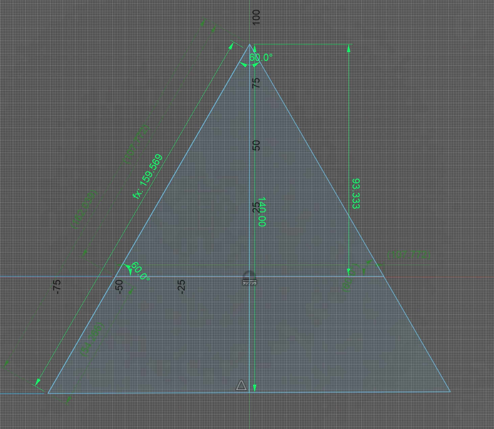

# Required printed parts
* 2 * [Brace](Brace.stl)
* 2 * [Brace](Brace.stl) (Morrored around the `y` axis)  
* 2 * [Top](Top.stl)
* 4 * [Foot](Foot.stl)  
* 2 * [Staff Holder](StaffHolder.stl) for each staff you want to store on the stand  

# Required rods
All these rods need to be 3mm in diameter

* 4 * 160mm
* 2 * 108mm

<!--  -->

